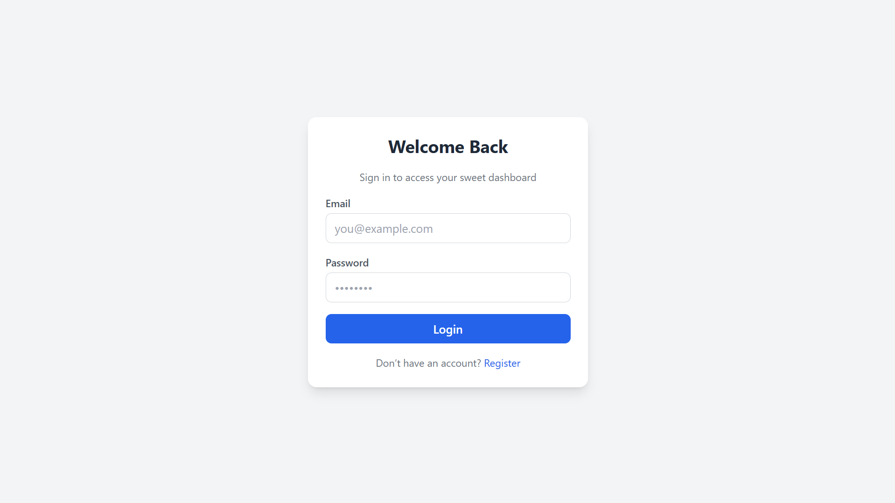
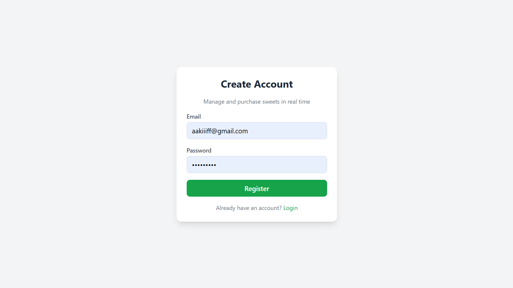
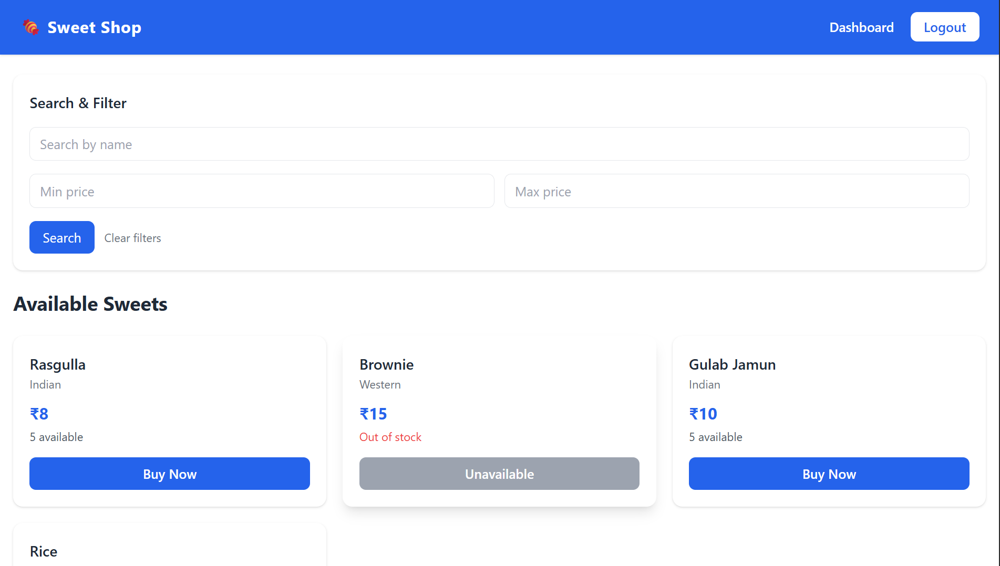
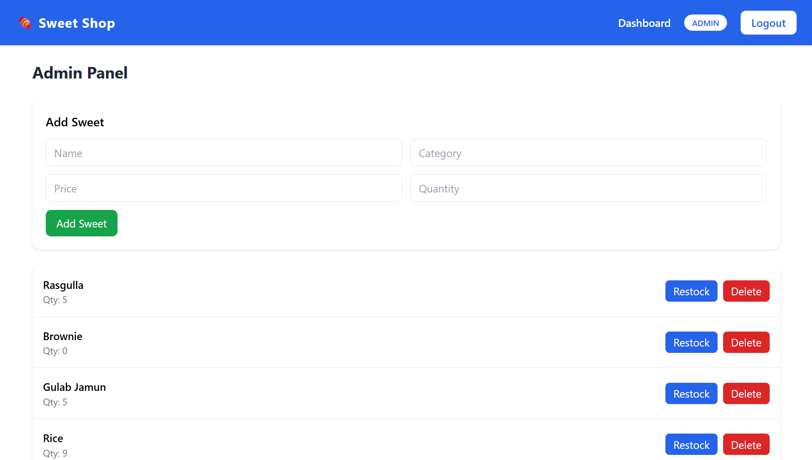
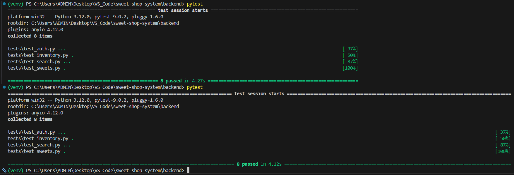

# Sweet Shop Management System

A full-stack **Sweet Shop Management System** built as a **Test-Driven Development (TDD) kata**.

The goal of this project was to design, build, and test a production-style application by strictly following the **Red–Green–Refactor** workflow while implementing authentication, authorization, and inventory management.

---

## Features

### Authentication & Authorization

- User registration and login  
- JWT-based authentication  
- Role-based access control (USER / ADMIN)  
- Protected API endpoints  

### Sweets Management

- View all available sweets  
- Search sweets by name, category, and price range  
- Purchase sweets (quantity decreases automatically)  
- Purchase disabled when stock is zero  

### Admin Features

- Add new sweets  
- Update sweet details  
- Delete sweets  
- Restock inventory  
- Admin access enforced on the backend  

### Testing

- Test-Driven Development (TDD)  
- Unit & integration tests for:
  - Authentication  
  - Sweets CRUD  
  - Inventory operations  
  - Search functionality  
- Proper test isolation using a clean database state for each test  

---

## Design & User Experience

The frontend was designed with clarity, usability, and responsiveness as primary goals.

Key design considerations include:

- Role-aware navigation (admin functionality is only visible to admin users)  
- Clear visual hierarchy for sweet cards (name, category, price, stock)  
- Disabled actions when operations are not allowed (e.g., purchase when out of stock)  
- Search and filtering to help users quickly find relevant sweets  
- Responsive layout using a mobile-first grid system  
- Loading and inline error feedback for authentication flows  
- Form inputs and actions designed with basic accessibility considerations  

Rather than focusing on animations or visual effects, the UI prioritizes accessibility, intuitive interactions, and real-world usability.

The application uses `/` as the authenticated home route.  
The rendered view depends on the user’s role:

- **Regular users** see the Dashboard  
- **Admin users** see the Admin Panel  

---

## Authorization Model

The application follows a strict backend-enforced authorization model:

- All protected operations require a valid JWT  
- Admin-only operations (delete, restock) are enforced on the server  
- Frontend role-based routing is used only for user experience, not security  
- Unauthorized access attempts return appropriate HTTP error responses  

This ensures that security does not rely on frontend behavior.

---

## Tech Stack

### Backend

- **FastAPI**  
- **Python**  
- **SQLAlchemy**  
- **SQLite** (file-based database used for development and testing)  
- **JWT Authentication**  
- **Pytest**  

### Frontend

- **React + TypeScript**  
- **Vite**  
- **Axios**  
- **React Router**  
- **Tailwind CSS**  

---

## Project Structure

```

sweet-shop-system/
│
├── backend/
│   ├── app/
│   │   ├── routers/
│   │   ├── services/
│   │   ├── models/
│   │   ├── schemas/
│   │   ├── core/
│   │   └── main.py
│   ├── tests/
│   └── requirements.txt
│
├── frontend/
│   ├── src/
│   │   ├── pages/
│   │   ├── components/
│   │   ├── auth/
│   │   └── api/
│   └── package.json
│
└── README.md

````

---

## Getting Started

### Prerequisites

- Python 3.10+  
- Node.js 18+  
- Git  

---

## Backend Setup

```bash
cd backend
python -m venv venv
source venv/bin/activate  # Windows: venv\Scripts\activate
pip install -r requirements.txt
````

Start the server:

```bash
uvicorn app.main:app --reload
```

Backend runs at:

```
http://127.0.0.1:8000
```

---

## Frontend Setup

```bash
cd frontend
npm install
npm run dev
```

Frontend runs at:

```
http://localhost:5173
```

---

## Admin Setup

Admin users are provisioned via a **seed script or database update**.

Example:

```sql
UPDATE users SET role='ADMIN' WHERE email='admin@test.com';
```

In real-world systems, admin users are typically provisioned through operational workflows rather than self-registration.

---

## Running Tests

From the backend directory:

```bash
pytest
```

### Test Coverage Includes

* User registration & login
* JWT authentication
* Sweets CRUD operations
* Inventory purchase & restock
* Admin-only authorization checks
* Search filtering
* Database isolation between tests

---

## Test Report

All backend tests were executed using **pytest**.

The test suite includes unit and integration tests covering:

* User registration and login
* JWT authentication and authorization
* Sweets CRUD operations
* Inventory purchase and restock logic
* Admin-only access enforcement
* Search by name, category, and price range
* Database isolation between tests

### Test Execution

From the backend directory:

```bash
pytest
```

### Result

```
========================= test session starts =========================
collected 8 items

backend/tests/test_auth.py ........
backend/tests/test_inventory.py ...
backend/tests/test_search.py ...
backend/tests/test_sweets.py ...

====================== 8 passed in 5.07s ======================
```

All tests passed successfully.

---

## API Contracts & Validation

* Request and response schemas are defined using Pydantic
* Input validation is handled at the API boundary
* Consistent response structures are enforced across endpoints
* Errors are returned with appropriate HTTP status codes

This ensures predictable client-server communication and simplifies frontend integration.

---

## Screenshots

Screenshots of the application are stored in the `/screenshots` directory and demonstrate key user flows and system behavior.

* Login page
* Register page
* User dashboard with sweets listing
* Purchase button disabled when stock is zero
* Admin panel (add / restock / delete sweets)
* Backend test suite execution report







---

## My AI Usage

AI tools were used selectively and responsibly during development.

### Tools Used

* ChatGPT

### How AI Was Used

* Brainstorming API endpoint structures
* Generating initial test templates
* Identifying edge cases during testing
* Refactoring suggestions for cleaner code structure

### Reflection

All architectural decisions, business logic, authorization rules, and final implementations were written and validated by me.
All critical debugging, architectural decisions, and security-related logic were reasoned about and implemented manually.

AI was used as a productivity assistant, not a replacement for understanding or decision-making, and significantly improved development speed while maintaining full ownership of the codebase.

---

## Notes for Evaluators

* Backend strictly enforces authorization rules
* Frontend role-based routing is used only for UX
* Test-Driven Development followed throughout
* Clean, descriptive commit history
* Transparent and responsible AI usage

---

## Design Trade-offs

* Pagination was omitted to keep the focus on core requirements
* UI state management was kept local to avoid unnecessary complexity
* Deployment was kept optional to prioritize correctness and testing

These decisions were made deliberately based on project scope and evaluation goals.

---


